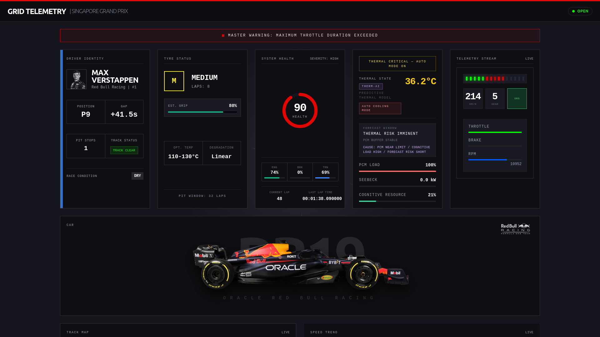
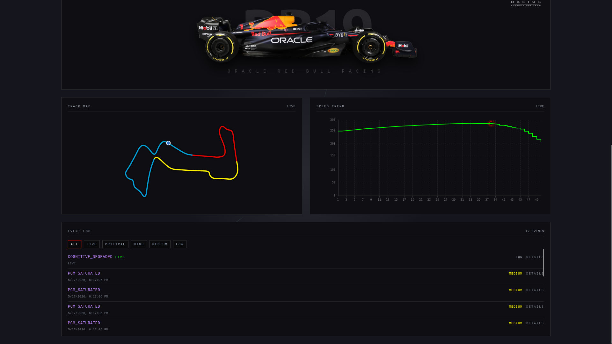

# Grid Telemetry

Production-grade F1 monitoring system with an industrial pitwall UI and a real-time telemetry pipeline.

## Overview

Grid Telemetry ingests race data, computes vehicle health signals, and streams updates to a Nuxt dashboard over WebSockets. It is designed to feel like a compact race control console: dense, legible, and fast.

## Features

- Live telemetry stream over WebSockets (speed, throttle, brake, RPM, gear, DRS).
- Health scoring and thermal monitoring with clear severity cues.
- Track position rendering and step-based speed trend charting.
- Event log with severity tagging.
- Dockerized local stack with Redis and PostgreSQL.

## Architecture

- `backend/` - FastAPI API, telemetry workers, Redis cache, PostgreSQL persistence.
- `frontend/` - Nuxt 3 UI with Tailwind-based industrial design system.
- `docker-compose.yml` - Local dev orchestration.

## Stack

- FastAPI
- Python 3.14
- FastF1 API
- Redis
- PostgreSQL
- Vue 3
- Nuxt 3
- Tailwind CSS

## Quick Start (Docker)

Start the full local stack:

```bash
docker compose up --build
```

Services:

- API: http://localhost:8000
- UI: http://localhost:3000

## Local Development

### Backend

```bash
python -m venv .venv
source .venv/bin/activate
pip install -U pip
pip install -e .
uvicorn backend.main:app --reload --host 0.0.0.0 --port 8000
```

### Frontend

```bash
cd frontend
npm install
npm run dev
```

The frontend expects the API at `http://localhost:8000` and WebSockets at
`ws://localhost:8000`.

## Configuration

Key environment variables (see `backend/core/config.py` and `docker-compose.yml`):

- `REDIS_URL`
- `POSTGRES_DSN`
- `FASTF1_CACHE_DIR`
- `FASTF1_DEFAULT_YEAR`, `FASTF1_DEFAULT_EVENT`, `FASTF1_DEFAULT_SESSION`

## Tests

```bash
pytest
```

## Screenshots





